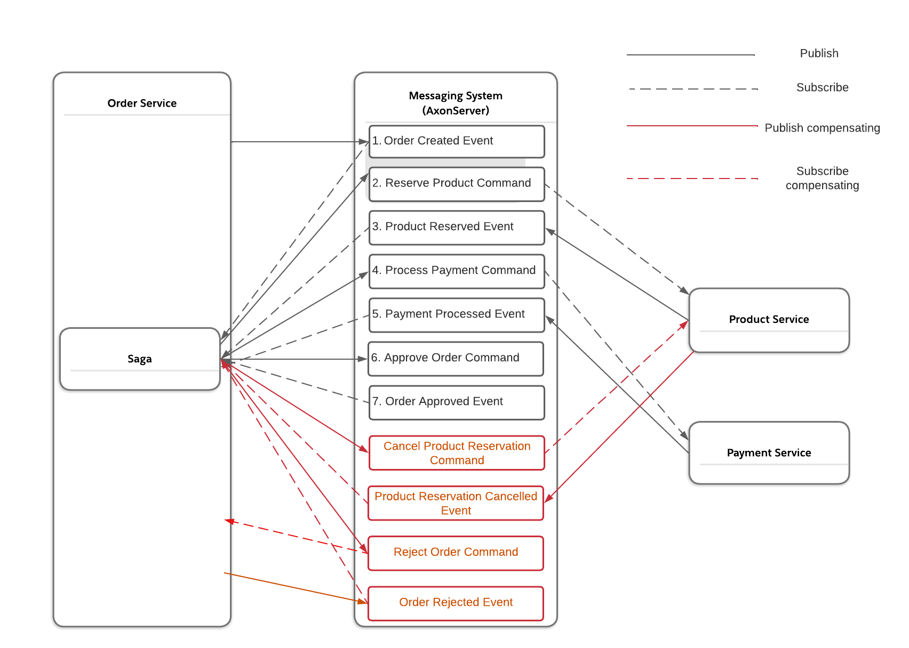

## CQRS & SAGA PROJECT
## Project
Sample project for Event-Driven Architecture using [Axon Framework](https://developer.axoniq.io/axon-framework/overview).
Axon Framework makes extremely easy to implement a CQRS architecture and is very well integrated to Spring and Spring Cloud (for doing the services discoverable). 

## Services Responsobility

- Order Service:

    - Management all saga orchestration
    - Management all command and event classes for order service

- Product Service:

    - Management of products command and query handlers

- Payment Service:
  - Management of payment command and query handlers
- User Service:
    - Management of users query handlers
## Saga
The Saga design pattern is a way to manage data consistency across microservices in distributed transaction scenarios. 
A saga is a sequence of transactions that updates each service and publishes a message or event to trigger the next transaction step. If a step fails, the saga executes compensating transactions that counteract the preceding transactions.
Orchestration is a way to coordinate sagas where a centralized controller tells the saga participants what local transactions to execute. The saga orchestrator handles all the transactions and tells the participants which operation to perform based on events. The orchestrator executes saga requests, stores and interprets the states of each task, and handles failure recovery with compensating transactions.
<br /> Axon provides support for handling orchestration-based sagas. Any exception in order service or remote exception in other service during saga execution flow will trigger compensating transaction and rollback changes. 



## Requirements
- [JDK 17](https://jdk.java.net/java-se-ri/17)  - gradle wrapper will use gradle 7.5.1, which supports java 18.
- [Docker 20.10+](https://www.docker.com/products/docker-desktop/) - starting from version 20.10, the Docker Engine supports communicating with the Docker host via host.docker.internal on Linux.
- [Docker-compose](https://docs.docker.com/compose/install/) - I have used Docker Compose 2.14.2 with Docker 20.10.22

## How to run it

- First run axon server and postgres

```bash
docker-compose up -d
```
- Build all
```bash
./gradlew build --parallel
```

- Run all

```bash
./gradlew bootRun --parallel
```

## How to test it
When testing through the REST endpoint using [IntelliJ Ultimate](https://www.jetbrains.com/help/idea/http-client-in-product-code-editor.html), you can use the included request.http file or use it content with tool that you like (curl, postman, etc.)